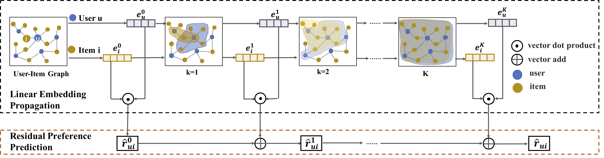

# LR-GCCF-AAAI20
Revisiting Graph based Collaborative Filtering: A Linear Residual Graph Convolutional Network Approach




Graph Convolutional Networks (GCNs) are state-of-the-art graph based representation learning models by iteratively stacking multiple layers of convolution aggregation operations and non-linear activation operations. Recently, in Collaborative Filtering (CF) domain, by treating the user-item interaction behavior as a bipartite graph, some researchers model the higher-layer collaborative signals with GCNs to alleviate the data sparsity issue in CF, and show superior performance compared to traditional works. However, these GCN based recommendation models suffer from the complexity and training difficulty with non-linear activations for large user-item graphs, and usually could not model deep layers of graph convolutions due to the over smoothing problem in the iterative process. In this paper, we revisit these graph based collaborative filtering models from two aspects. First, we empirically show that removing non-linearities would enhance recommendation performance, which is consistent with the theories in simple graph convolutional networks. Second, we propose a residual network structure that is specifically designed for CF with user-item interaction modeling, which alleviates the over smoothing problem in graph convolution aggregation operation with sparse data. The proposed model is a linear model and it is easy to train, scales to large datasets, and yields better efficiency and effectiveness on two real datasets.

We provide PyTorch implementations for LR-GCCF model.


## Train/test

- Train a model:

```python
#!./LR-GCCF/code
cd LR-GCCF
cd code
#for amazon dataset
python train_amazon.py
#for gowalla dataset
python train_gowalla.py
```

- Test a model:

```python
#!./LR-GCCF/code
cd LR-GCCF
cd code
#for amazon dataset
python test_amazon.py
#for gowalla dataset
python test_gowalla.py
```

## Project structure
```
.
├── [ 57K]  code
│   ├── [4.6K]  data_utils.py
│   ├── [4.0K]  evaluate.py
│   ├── [ 12K]  test_amazons.py
│   ├── [ 12K]  test_gowalla.py
│   ├── [9.9K]  train_amazons.py
│   └── [9.9K]  train_gowalla.py
├── [ 74M]  data
│   ├── [ 53M]  amazon-book
│   │   ├── [2.1K]  data2npy.py
│   │   ├── [ 36M]  datanpy
│   │   │   ├── [7.1M]  testing_set.npy
│   │   │   ├── [ 18M]  training_set.npy
│   │   │   └── [ 11M]  user_rating_set_all.npy
│   │   ├── [  93]  README.md
│   │   ├── [3.7M]  test.txt
│   │   └── [ 13M]  train.txt
│   ├── [2.1K]  data2npy.py
│   └── [ 21M]  gowalla
│       ├── [ 15M]  datanpy
│       │   ├── [2.9M]  testing_set.npy
│       │   ├── [6.3M]  training_set.npy
│       │   ├── [3.6M]  user_rating_set_all.npy
│       │   └── [2.1M]  val_set.npy
│       ├── [ 103]  README.md
│       ├── [1.3M]  test.txt
│       └── [4.4M]  train.txt
├── [763K]  images
│   ├── [739K]  Overall_framework.jpg
│   └── [ 20K]  process_flow.svg
├── [ 57K]  nbs
│   └── [ 53K]  P174968_LR_GCCF_on_Gowalla.ipynb
├── [3.6K]  README.md
└── [ 13K]  reports
    └── [8.5K]  S794944_report.ipynb

  75M used in 9 directories, 26 files
```

## References

1. [https://github.com/RecoHut-Stanzas/S794944](https://github.com/RecoHut-Stanzas/S794944)
2. [https://arxiv.org/abs/2001.10167](https://arxiv.org/abs/2001.10167)
3. [https://github.com/newlei/LR-GCCF](https://github.com/newlei/LR-GCCF)